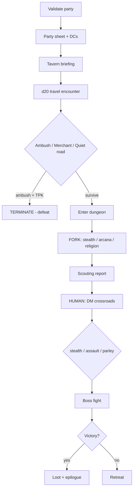

# Orchestrating a D&D Quest with Conductor OSS

**JC Choi** · Jun 10, 2026 · 8 min read

> *Workflow orchestration, fork/join scouting, and a human-in-the-loop dungeon master*

Most workflow-engine tutorials start with order fulfillment: charge the card, ship the box, send the email. That’s fine, but it doesn’t show why orchestration is *fun* to think about.

I wanted a demo where branching, parallelism, randomness, and “wait for a human” feel natural — so I built a **Dungeons & Dragons quest pipeline** in [Conductor OSS](https://github.com/conductor-oss/conductor).

The code is JSON. No custom workers. No microservices. Just a workflow definition, a local server, and a CLI. Somewhere between the tavern briefing and the boss fight, Conductor stopped and asked me to make a decision like a dungeon master.

That’s when it clicked.

---

> ### TL;DR
>
> - Three workflow demos in [conductor_oss](https://github.com/jcpopdigitalpartners/conductor_oss): hello-world, hiring pipeline, D&D quest.
> - The quest uses **SWITCH**, **FORK_JOIN**, **HUMAN**, and **TERMINATE** tasks — no custom backend.
> - Run locally with `conductor server start` + Java 21.
> - The hard parts were operational: WSL + SQLite on `/mnt/c/`, stale IDs, and UI search — not the JSON.

---

## Why Conductor?

[Conductor](https://conductor-oss.github.io/conductor/) is a workflow orchestration engine originally from Netflix. You define processes as JSON: tasks, inputs, outputs, retries, and branching. A server executes them **durably** — if a step fails or the process pauses for days, state is preserved.

Scripts call APIs in order. Cron kicks off jobs. Queues fan out work. Orchestration earns its keep when you need:

| Need | Example in the quest |
|------|----------------------|
| Conditional paths | Auto-reject on failed screening |
| Parallel work | Rogue, wizard, and cleric scout at once |
| Human approval | DM picks stealth, assault, or parley |
| Execution history | See exactly what ran and what’s waiting |

Install the CLI, start a local server, register a workflow JSON file, run it. The UI at `http://localhost:8080` shows every step.

---

## Why a D&D quest?

A hiring pipeline is a good *professional* demo. A D&D quest is a good *pedagogical* one.

| D&D beat | Conductor feature |
|----------|-------------------|
| Random travel encounter | `INLINE` task + d20 roll |
| Ambush vs. safe road | `SWITCH` branch |
| Rogue / wizard / cleric scouting | `FORK_JOIN` + `JOIN` |
| DM chooses the approach | `HUMAN` task |
| Boss fight resolution | `SWITCH` + `TERMINATE` |
| Total party kill on the road | Early `TERMINATE` (`FAILED`) |

The names are on-the-nose on purpose — `Vault of Shattered Sigils`, `Codex of Forked Paths` — because fork/join is literally the lesson.

---

## The pipeline



**Input:** send a party as JSON.

```json
{
  "partyName": "The Conductor's Company",
  "questGiver": "Magistrate Elara Voss",
  "dungeonName": "Vault of Shattered Sigils",
  "questObjective": "Recover the Codex of Forked Paths before the cult completes the ritual",
  "difficulty": "hard",
  "party": [
    { "name": "Kaelen", "class": "fighter", "level": 6 },
    { "name": "Sera", "class": "rogue", "level": 6 },
    { "name": "Theron", "class": "wizard", "level": 5 },
    { "name": "Mira", "class": "cleric", "level": 6 }
  ]
}
```

Conductor rolls dice in GraalJS `INLINE` tasks, branches on outcomes, merges parallel probes into a scouting report, then **stops** at `dm_crossroads_ref` until a human completes the `HUMAN` task.

> **The pause is the point.** The workflow doesn’t crash or spin — it waits, durably, until you send the next signal.

---

## Running it (WSL)

**Prerequisites:** WSL · Java 21 · [Conductor CLI](https://github.com/conductor-oss/conductor-cli)

### Step 1 — Start the server

```bash
cd ~
conductor server start
```

> ⚠️ **WSL:** Start from `~`, not `/mnt/c/...`. SQLite shared memory fails on Windows mounts.

### Step 2 — Register the workflow

Once per fresh database:

```bash
cd /mnt/c/Users/jobec/projects/conductor_oss
conductor workflow create dnd_quest_pipeline.json
```

### Step 3 — Start a quest

```bash
conductor workflow start -w dnd_quest_pipeline -f sample_quest_input.json
# → 814893c9-b9c4-4bf7-9277-28910c4f11ae
```

### Step 4 — Verify

```bash
conductor workflow get-execution <workflow-id>
```

Look for: `RUNNING` · early tasks `COMPLETED` · `dm_crossroads_ref` → `IN_PROGRESS` · type `HUMAN`

### Step 5 — Play the DM

```bash
conductor task update-execution \
  --workflow-id <workflow-id> \
  --task-ref-name dm_crossroads_ref \
  --status COMPLETED \
  --output '{"approach":"stealth","dmNotes":"The cultists are mid-ritual — shadows favored."}'
```

Try `"assault"` or `"parley"` for different paths. Boss fight and epilogue run automatically after this.

---

## What broke

### SQLite hates `/mnt/c/` in WSL

```text
SQLITE_IOERR_SHMOPEN — disk I/O error (shared memory)
```

**Fix:** start the server from `~`. If you see `c123.db` in the project folder, that’s the SQLite file landing on the Windows mount.

### “Workflow not found” on a fresh server

Register before you run:

```bash
conductor workflow create dnd_quest_pipeline.json   # definition
conductor workflow start -w dnd_quest_pipeline ...  # execution
```

### Executions hidden in the UI

Go to **Executions** (not Definitions) → Workflow Name `dnd_quest_pipeline` → clear filters → **Search**.

Direct link: `http://localhost:8080/execution/<workflow-id>`

### Resetting for a fresh start

```bash
conductor server stop && pkill -f conductor-server.jar
```

```powershell
# Delete DB from Windows if WSL rm fails (file locked)
Remove-Item -Force c:\Users\jobec\projects\conductor_oss\c123.db*
```

---

## What I learned

1. **Orchestration shines when the process is messy** — randomness, parallelism, early exits, human choice.
2. **HUMAN tasks are the “aha”** — the workflow sits at `IN_PROGRESS` until you decide. That’s not a queue; that’s orchestration.
3. **INLINE tasks are enough for demos** — production swaps them for HTTP/workers; the graph stays the same.
4. **Operations > definitions** — WSL, SQLite, UI search, and dual servers cost more time than the JSON.
5. **GitHub Pages ≠ deployment** — great for workflow JSON; still need a Java server to run them.

---

## Taking it to the next level

The demo is intentionally self-contained: GraalJS `INLINE` tasks simulate dice rolls, workers, and narration. The workflow graph is the real artifact. Here’s how you’d evolve it without changing the story.

| Upgrade | What it adds | Quest example |
|---------|----------------|---------------|
| **SIMPLE workers** | Real services you own | `roll_dice` worker, `boss_combat` worker with game rules in Python |
| **HTTP tasks** | Call external APIs | Post to Slack when the party hits the DM crossroads |
| **Event handlers** | React to task state changes | Auto-start a notification workflow when `HUMAN` → `IN_PROGRESS` |
| **SUB_WORKFLOW** | Reusable sub-stories | Random encounter table as a nested quest |
| **WAIT tasks** | Pause on external events | Resume when a player clicks a link in Discord |
| **`failureWorkflow`** | Cleanup on crash | Release locks, notify party, log audit trail |
| **Versioning** | Ship v2 without breaking runs | Add a “bribe the guard” branch in `dnd_quest_pipeline` v2 |

### Notify the DM when the crossroads arrives

Instead of polling the UI, add an event handler that fires when a `HUMAN` task starts:

```json
{
  "name": "dm_crossroads_notifier",
  "event": "conductor:TASK_STATUS_CHANGE",
  "condition": "$.taskType == 'HUMAN' && $.status == 'IN_PROGRESS'",
  "actions": [{
    "action": "start_workflow",
    "start_workflow": {
      "name": "slack_notify_workflow",
      "input": {
        "workflowId": "${workflowId}",
        "message": "The party awaits your ruling at the crossroads."
      }
    }
  }]
}
```

The DM gets pinged. The quest stays paused until they complete the task — same HUMAN gate, better UX.

### Swap INLINE for a real worker

Production boss fights probably shouldn’t live in a JSON string. Register a worker that polls for `boss_encounter` tasks:

```python
# worker.py (sketch)
from conductor.client.worker.worker import Worker
from conductor.client.worker.worker_task import worker_task

@worker_task(task_definition_name="boss_encounter")
def resolve_boss(combat_state: dict) -> dict:
    # your rules engine, DB, or combat library
    return run_combat_rounds(combat_state)
```

The workflow keeps the same shape; only the task type changes from `INLINE` to `SIMPLE`.

### Deploy beyond localhost

Local `conductor server start` is for learning. Next steps for a shared environment:

- **Docker** on a VPS, Railway, or Fly.io
- **Orkes Conductor** (managed) if you want auth, scaling, and support out of the box
- Keep workflow JSON in git; CI registers definitions on merge

The blog you’re reading is on GitHub Pages. The *engine* still needs a JVM somewhere — Pages hosts the story, not the quest.

---

## Repo contents

| File | Purpose |
|------|---------|
| `workflow.json` | Hello-world (HTTP + INLINE) |
| `job_application_pipeline.json` | Hiring flow + manager review |
| `dnd_quest_pipeline.json` | Full D&D quest |
| `sample_quest_input.json` | Level 6 party, hard |
| `sample_quest_input_low_level.json` | Level 2 party, easy |

---

## Try it yourself

```bash
cd ~ && conductor server start
cd /path/to/conductor_oss
conductor workflow create dnd_quest_pipeline.json
conductor workflow start -w dnd_quest_pipeline -f sample_quest_input.json
```

Open http://localhost:8080 · find your run under **Executions** · pick stealth, assault, or parley at the crossroads.

---

The quest is a toy. The pattern isn’t: **define the story as data, let the engine run the boring parts, pause where humans belong.**

That’s worth a d20 roll.

<p align="center"><em>By JC Choi · <a href="https://github.com/jcpopdigitalpartners/conductor_oss">github.com/jcpopdigitalpartners/conductor_oss</a></em></p>
